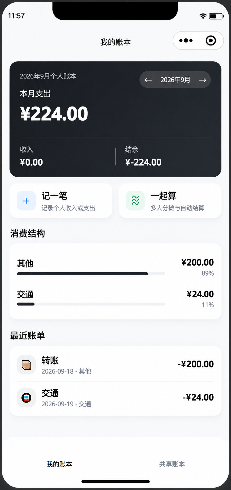
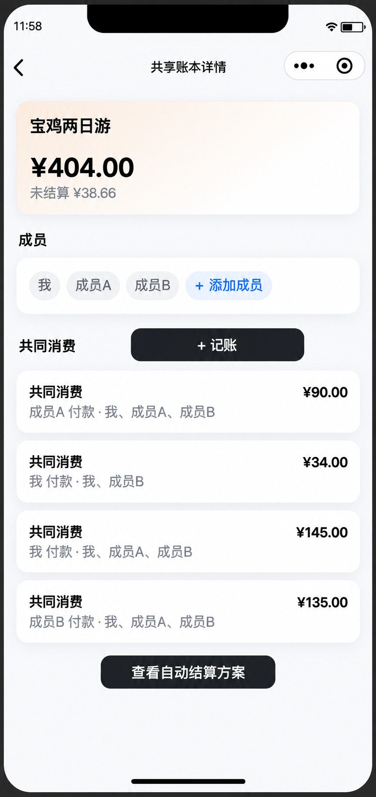
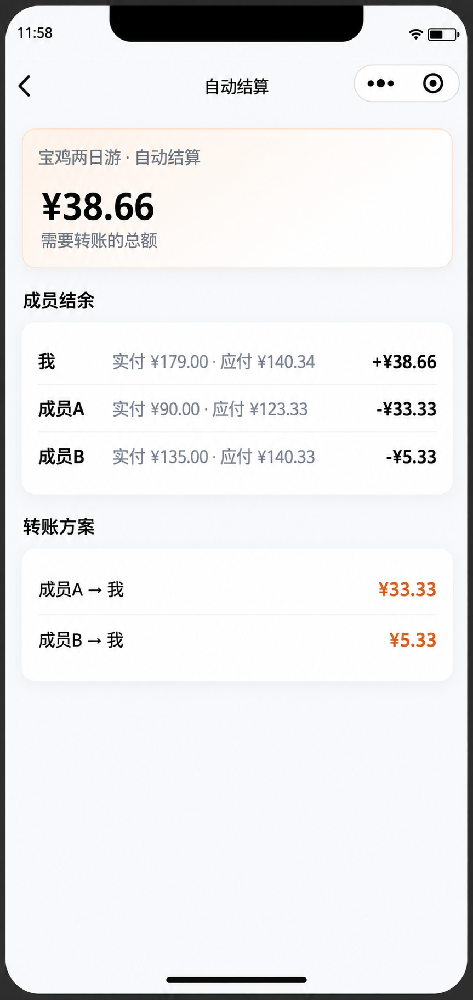
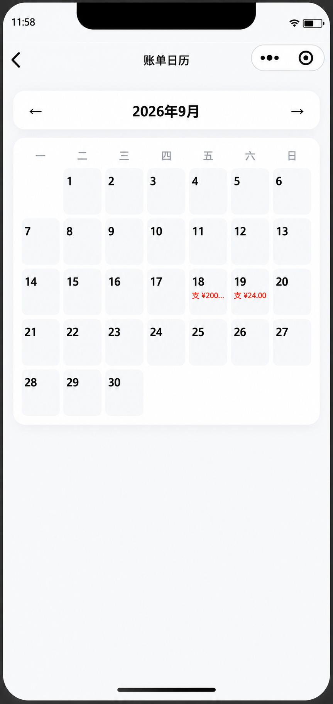

# 一起账 · 微信小程序

一款面向个人消费管理与多人 AA 场景的微信记账小程序。

支持个人收支记录、消费分类统计、账单日历、共享账本以及多人消费自动结算。

---

## 📌 项目介绍

日常生活中，微信、支付宝、银行卡等多个支付渠道会产生大量消费记录，个人消费管理逐渐变得复杂。

同时，在旅行、聚餐、合租等多人消费场景中，传统群收款只能解决固定金额收取问题，无法处理：

- 多人共同消费
- 不同成员多次垫付
- 部分成员参与消费
- 不同金额参与分摊
- 最终账单自动结算

因此设计「一起账」，通过统一账本管理和自动结算功能，降低个人记账和多人 AA 分摊的复杂度。

---

## ✨ 核心功能

### 1. 个人账本

支持个人收入、支出记录，以及消费分类统计。

主要功能：

- 收入 / 支出记录
- 消费分类统计
- 月份切换
- 最近账单查看


<div align="center">

</div>


---

### 2. 共享账本

面向旅行、聚餐、合租等多人消费场景。

支持：

- 创建共享账本
- 添加成员
- 记录共同消费
- 查看成员消费情况


<div align="center">

</div>


---

### 3. AA 自动结算

根据每个成员实际支付金额和消费参与情况，自动计算最终转账方案。

解决多人消费后的复杂计算问题：

- 谁应该收钱
- 谁需要补钱
- 每个人最终承担金额


<div align="center">

</div>


---

### 4. 账单日历

通过日历视图查看每日消费记录。

支持：

- 按日期查看消费
- 快速定位历史账单
- 月份切换


<div align="center">

</div>


---

# 🛠 技术方案

## 技术栈

- 微信小程序原生开发
- JavaScript
- WXML
- WXSS
- 微信 Storage 本地数据存储


## 数据设计

采用本地 Storage 进行数据管理：

- 用户账单数据
- 分类信息
- 共享账本数据
- 成员消费记录


## 核心逻辑

### 账单管理

用户录入消费信息后：

```
用户操作
    ↓
页面组件
    ↓
数据处理逻辑
    ↓
Storage 本地存储
```


### AA 结算

根据：

- 每位成员实际支付金额
- 消费参与情况
- 总消费金额

计算：

- 每个人应承担金额
- 最终转账关系


---

# 📂 项目结构

```
yiqizhang
│
├── assets                  # 图片资源
│
├── pages                   # 页面模块
│   ├── home                # 首页
│   ├── add                 # 添加账单
│   ├── shared              # 共享账本
│   ├── settlement          # 自动结算
│   └── calendar            # 账单日历
│
├── utils                   # 公共工具函数
│
├── app.js
├── app.json
├── app.wxss
└── project.config.json
```

---

# 🚀 运行方式

## 1. 下载项目

```bash
git clone https://github.com/DJ-you/yiqizhang.git
```


## 2. 导入项目

使用微信开发者工具导入项目目录。


## 3. 编译运行

选择对应基础库版本后即可运行。

---

# 📍 当前版本

## v0.1 MVP

已实现：

- ✅ 个人账本
- ✅ 收支记录
- ✅ 消费分类统计
- ✅ 月份切换
- ✅ 账单日历
- ✅ 多人共享账本
- ✅ 成员消费记录
- ✅ AA 自动结算


---

# 🔮 后续规划

- [ ] 支持云端数据同步
- [ ] 增加用户账号体系
- [ ] 优化多人协作体验
- [ ] 增加消费趋势分析
- [ ] 增加智能化消费分析能力


---

# 📄 项目文档

产品设计文档：

`PRODUCT-v0.1.md`

包含：

- 产品背景分析
- 用户需求分析
- 功能规划
- MVP 迭代过程


---

# 📬 开源说明

本项目用于学习、交流和个人项目展示。

欢迎提出建议和改进方案。
